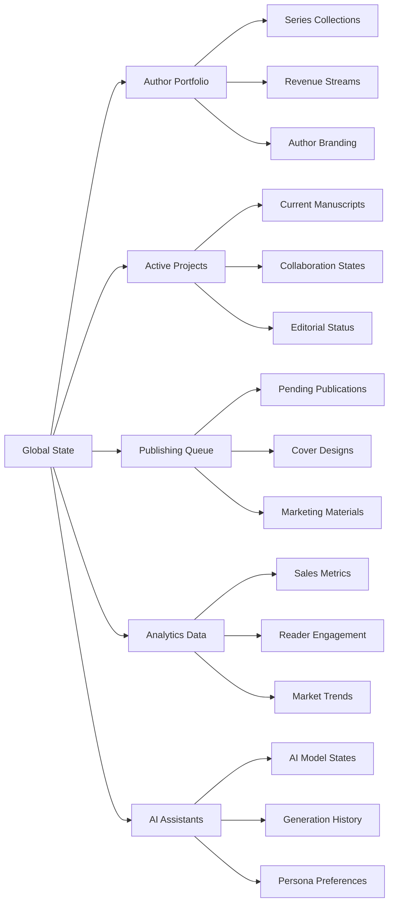

# 88Away: Enterprise Romance Publishing Platform Design

## Overview

88Away transforms from a collaborative writing platform into the world's premier enterprise-level KDP novel ghostwriting, editing, and publishing ecosystem, specifically engineered for romance literature. This platform combines cutting-edge AI technology, professional publishing workflows, and stunning visual design to serve authors, ghostwriters, editors, publishers, and literary agencies at commercial scale.

### Vision Statement
To become the definitive platform where romance stories are conceived, crafted, polished, and published with unprecedented efficiency, quality, and commercial success.

### Core Value Propositions
- **Romance-First Design**: Every feature optimized for romance genre conventions, tropes, and reader expectations
- **Commercial Publishing Pipeline**: End-to-end workflow from concept to KDP publication
- **Enterprise Scalability**: Multi-tenant architecture supporting publishing houses and literary agencies
- **AI-Powered Excellence**: Specialized AI assistants trained on romance literature best practices
- **Professional Quality Assurance**: Built-in editorial standards and publishing guidelines

## Technology Stack & Dependencies

### Enhanced Frontend Architecture
- **Core Framework**: React 18+ with TypeScript for type safety
- **UI Component Library**: Radix UI primitives with custom romance-themed design system
- **Real-time Collaboration**: Yjs CRDT with enhanced presence indicators
- **State Management**: Zustand with persistence for complex publishing workflows
- **Styling**: Tailwind CSS with custom romance-inspired color palettes and typography
- **Charts & Analytics**: Recharts for detailed sales and engagement metrics
- **Rich Text Editing**: TipTap with romance-specific formatting tools

### Backend Infrastructure
- **Runtime**: Node.js with Express.js for high-performance API handling
- **Database**: PostgreSQL with Drizzle ORM for complex publishing relationships
- **Real-time Engine**: WebSocket server for collaborative editing and live updates
- **AI Integration**: OpenAI API with custom romance-trained models
- **File Processing**: Advanced document export with professional formatting
- **Email/SMS**: Brevo integration for marketing and notifications

### Enterprise Integrations
- **Payment Processing**: Stripe for subscription management and marketplace transactions
- **Publishing APIs**: KDP, IngramSpark, and other POD service integrations
- **Analytics**: Enhanced tracking for commercial performance metrics
- **Content Delivery**: Optimized asset delivery for global user base

## Component Architecture

### Romance-Specific Component Hierarchy

```mermaid
graph TD
    A[Romance Publishing Platform] --> B[Author Dashboard]
    A --> C[Project Management Suite]
    A --> D[AI Writing Assistants]
    A --> E[Editorial Workflow]
    A --> F[Publishing Pipeline]
    A --> G[Analytics & Insights]
    
    B --> B1[Portfolio Management]
    B --> B2[Revenue Tracking]
    B --> B3[Series Management]
    
    C --> C1[Romance Project Templates]
    C --> C2[Character Relationship Maps]
    C --> C3[Trope & Theme Tracker]
    C --> C4[Heat Level Manager]
    
    D --> D1[Romance Muse AI]
    D --> D2[Spice Level Editor]
    D --> D3[Dialogue Coach]
    D --> D4[Tension Builder]
    
    E --> E1[Professional Editor Assignment]
    E --> E2[Romance Genre Validation]
    E --> E3[Content Rating System]
    E --> E4[Quality Assurance Pipeline]
    
    F --> F1[Cover Design Studio]
    F --> F2[Blurb Generator]
    F --> F3[KDP Direct Publishing]
    F --> F4[Series Launch Coordinator]
    
    G --> G1[Sales Performance]
    G --> G2[Reader Engagement Metrics]
    G --> G3[Market Trend Analysis]
    G --> G4[ROI Calculator]
```



### Enhanced Component Definitions

#### Romance Project Management Components
- **SeriesManagementPanel**: Comprehensive series planning with book dependencies and character continuity
- **RomanceTemplateLibrary**: Genre-specific templates (contemporary, historical, paranormal, etc.)
- **TropeTracker**: Interactive trope selection and conflict avoidance system
- **HeatLevelManager**: Content rating and spice level consistency tools
- **CharacterRelationshipMapper**: Visual relationship dynamics and character arc tracking

#### AI Assistant Components (Romance-Specialized)
- **RomanceMuse**: AI trained on romance conventions for scene generation
- **DialogueCoach**: Specialized in romantic dialogue and chemistry building  
- **TensionBuilder**: AI focused on romantic and sexual tension escalation
- **SpiceLevelEditor**: Content-aware editing for different heat levels
- **EmotionalArcAnalyzer**: Romance pacing and emotional beat tracking

#### Professional Publishing Components
- **CoverDesignStudio**: Romance-specific cover templates and design tools
- **BlurbGenerator**: AI-powered back cover copy optimized for romance marketing
- **KDPPublisher**: Direct integration with Kindle Direct Publishing
- **SeriesLaunchCoordinator**: Multi-book release scheduling and cross-promotion
- **MetadataOptimizer**: Keyword and category optimization for discoverability

#### Enterprise Management Components
- **ClientPortfolio**: Multi-author/client management for agencies
- **RevenueAnalytics**: Detailed financial tracking and reporting
- **TeamCollaboration**: Role-based access for editors, ghostwriters, and clients
- **QualityAssurance**: Automated and manual quality control workflows
- **BrandManagement**: Consistent author brand and voice maintenance

## Routing & Navigation

### Romance-Optimized Site Architecture

| Route | Component | Purpose | Access Level |
|-------|-----------|---------|--------------|
| `/` | RomanceLanding | Genre-specific marketing page | Public |
| `/dashboard` | AuthorDashboard | Romance author control center | Authenticated |
| `/projects/:id` | RomanceProject | Enhanced project management | Project Member |
| `/projects/:id/series` | SeriesManager | Multi-book series planning | Project Owner+ |
| `/projects/:id/characters` | CharacterRelationshipMap | Romance character dynamics | Project Member |
| `/projects/:id/scenes` | SceneBuilder | Romance scene crafting tools | Project Member |
| `/projects/:id/spice` | HeatLevelManager | Content rating management | Project Owner+ |
| `/publishing/:id` | PublishingPipeline | KDP publishing workflow | Project Owner+ |
| `/covers/:id` | CoverDesignStudio | Romance cover creation | Project Member |
| `/analytics/:id` | RomanceAnalytics | Genre-specific performance | Project Owner+ |
| `/marketplace` | ServiceMarketplace | Professional services hub | Authenticated |
| `/templates` | RomanceTemplates | Genre template library | Authenticated |
| `/tools/tropes` | TropeExplorer | Romance trope database | Authenticated |
| `/tools/research` | RomanceResearch | Market research tools | Authenticated |
| `/enterprise` | EnterprisePortal | Agency/publisher dashboard | Enterprise |

## State Management

### Romance Publishing Store Architecture



### Enhanced State Schema

#### Author Portfolio State
- **series**: Collection of book series with metadata and performance
- **publishedWorks**: Complete bibliography with sales data
- **revenueStreams**: Multiple income source tracking
- **authorBrand**: Voice, style, and market positioning data
- **collaborationNetwork**: Professional relationships and team members

#### Romance Project State  
- **manuscript**: Enhanced document with romance-specific metadata
- **characters**: Detailed character profiles with relationship dynamics
- **worldbuilding**: Romance-specific world elements (settings, social structures)
- **tropes**: Active trope tracking and conflict resolution
- **heatLevel**: Content rating and spice level consistency
- **publicationPlan**: Marketing and release strategy

#### Publishing Pipeline State
- **coverDesigns**: Multiple cover variations and A/B testing
- **metadata**: Optimized keywords, categories, and descriptions
- **distributionChannels**: Multi-platform publishing coordination
- **marketingCampaigns**: Promotional material and scheduling
- **qualityAssurance**: Editorial checklist and approval workflows

## API Integration Layer

### Romance Publishing API Architecture

#### Core Publishing APIs
- **KDP Integration**: Direct publishing to Amazon Kindle Direct Publishing
- **IngramSpark API**: Print-on-demand and distribution services  
- **Bookfunnel API**: Reader magnet and book delivery
- **BookBub API**: Promotional campaign management
- **Goodreads API**: Reader engagement and review management

#### AI & Content APIs
- **Romance AI Models**: Specialized content generation for romance scenes
- **Character Consistency API**: Cross-book character tracking
- **Trope Analysis API**: Romance trope identification and suggestions
- **Heat Level Detection**: Automated content rating analysis
- **Market Trend API**: Romance genre trend analysis

#### Professional Services APIs
- **Editor Marketplace**: Professional editor matching and assignment
- **Cover Designer API**: Romance cover design service integration
- **Ghostwriter Network**: Professional ghostwriter coordination
- **Beta Reader Platform**: Reader feedback and testing services
- **Translation Services**: Multi-language romance content support

### Enhanced API Endpoints

#### Romance Project Management
```
GET    /api/romance/projects                 # Romance-optimized project listing
POST   /api/romance/projects/template        # Create from romance template
GET    /api/romance/projects/:id/series      # Series management data
PUT    /api/romance/projects/:id/tropes      # Update trope tracking
GET    /api/romance/projects/:id/heat-level  # Content rating analysis
```

#### AI Romance Assistants
```
POST   /api/ai/romance/scene-generation      # Romance scene creation
POST   /api/ai/romance/dialogue-enhancement  # Romantic dialogue improvement
POST   /api/ai/romance/tension-analysis      # Romantic tension evaluation
POST   /api/ai/romance/spice-level-edit      # Heat level content editing
POST   /api/ai/romance/character-chemistry   # Character relationship analysis
```

#### Publishing Pipeline
```
GET    /api/publishing/kdp/categories        # KDP romance categories
POST   /api/publishing/covers/generate       # Romance cover generation
POST   /api/publishing/blurbs/optimize       # Marketing copy optimization
POST   /api/publishing/metadata/analyze      # Keyword optimization
GET    /api/publishing/trends/romance        # Genre trend analysis
```

#### Enterprise Management
```
GET    /api/enterprise/clients               # Client portfolio management
GET    /api/enterprise/revenue               # Multi-client revenue tracking
POST   /api/enterprise/team/assign           # Professional assignment
GET    /api/enterprise/quality-metrics       # Quality assurance dashboard
```

## Styling Strategy

### Romance Genre Design System

#### Color Palette Strategy
- **Primary Romance Palette**: Deep burgundy, rose gold, blush pink, champagne
- **Secondary Accents**: Midnight black, pearl white, warm copper
- **Emotional Gradients**: Passion reds, tender pinks, sensual purples
- **Professional Neutrals**: Sophisticated grays, warm off-whites

#### Typography Hierarchy
- **Primary Font**: Elegant serif for headings (romance book aesthetic)
- **Secondary Font**: Clean sans-serif for body text (readability focus)
- **Accent Font**: Script font for romantic elements and branding
- **Monospace Font**: Professional monospace for code and metadata

#### Component Styling Approach
- **Romance-Themed Components**: Custom-styled components with genre-appropriate aesthetics
- **Professional Polish**: High-end finish suitable for commercial publishing environment
- **Accessibility First**: WCAG AA compliance with romance-friendly color contrasts
- **Responsive Design**: Mobile-first approach for authors working on various devices

#### Visual Design Elements
- **Iconography**: Custom icon set with romance and publishing themes
- **Illustrations**: Sophisticated graphics avoiding cliché romance imagery
- **Photography**: Professional stock photos emphasizing diversity and authenticity
- **Animations**: Subtle transitions that enhance user experience without distraction

## Testing Strategy

### Romance Platform Testing Framework

#### Component Testing Philosophy
- **Romance Feature Testing**: Specialized tests for genre-specific functionality
- **AI Assistant Testing**: Validation of romance content generation quality
- **Publishing Workflow Testing**: End-to-end publication process verification
- **Collaboration Testing**: Multi-user romance project scenarios
- **Performance Testing**: Large manuscript and media handling

#### Test Categories

##### Unit Testing (Jest)
- **Romance AI Components**: Validate genre-specific AI response handling
- **Publishing Utilities**: Test KDP integration and metadata processing
- **Character Relationship Logic**: Verify complex character dynamic calculations
- **Content Rating Systems**: Ensure accurate heat level detection and management
- **Revenue Calculation**: Test complex royalty and payment distribution logic

##### Integration Testing
- **AI Service Integration**: End-to-end testing of romance content generation
- **Publishing API Integration**: Verify KDP and distribution service connections  
- **Payment Processing**: Test subscription and marketplace transaction flows
- **Real-time Collaboration**: Multi-user editing and presence system testing
- **Email/SMS Integration**: Marketing and notification delivery testing

##### End-to-End Testing (Cypress)
- **Complete Publishing Workflow**: From manuscript creation to KDP publication
- **Multi-Author Collaboration**: Team-based romance project development
- **Enterprise Client Management**: Agency and publisher workflow testing
- **AI-Assisted Writing Session**: Complete AI-enhanced writing experience
- **Revenue and Analytics Tracking**: Financial performance monitoring workflows

##### Performance Testing
- **Large Manuscript Handling**: Testing with full-length romance novels (80k+ words)
- **Concurrent User Load**: Multiple authors collaborating simultaneously
- **AI Response Times**: Ensuring quick turnaround for creative workflow
- **Media Asset Management**: Cover design and marketing material performance
- **Database Query Optimization**: Complex relationship and analytics queries

##### Romance-Specific Testing Scenarios
- **Trope Conflict Detection**: Ensure contradictory tropes are flagged
- **Heat Level Consistency**: Validate content rating across manuscript
- **Character Arc Continuity**: Test character development tracking across series
- **Series Continuity**: Verify consistency across multi-book series
- **Market Trend Accuracy**: Validate romance genre trend analysis
